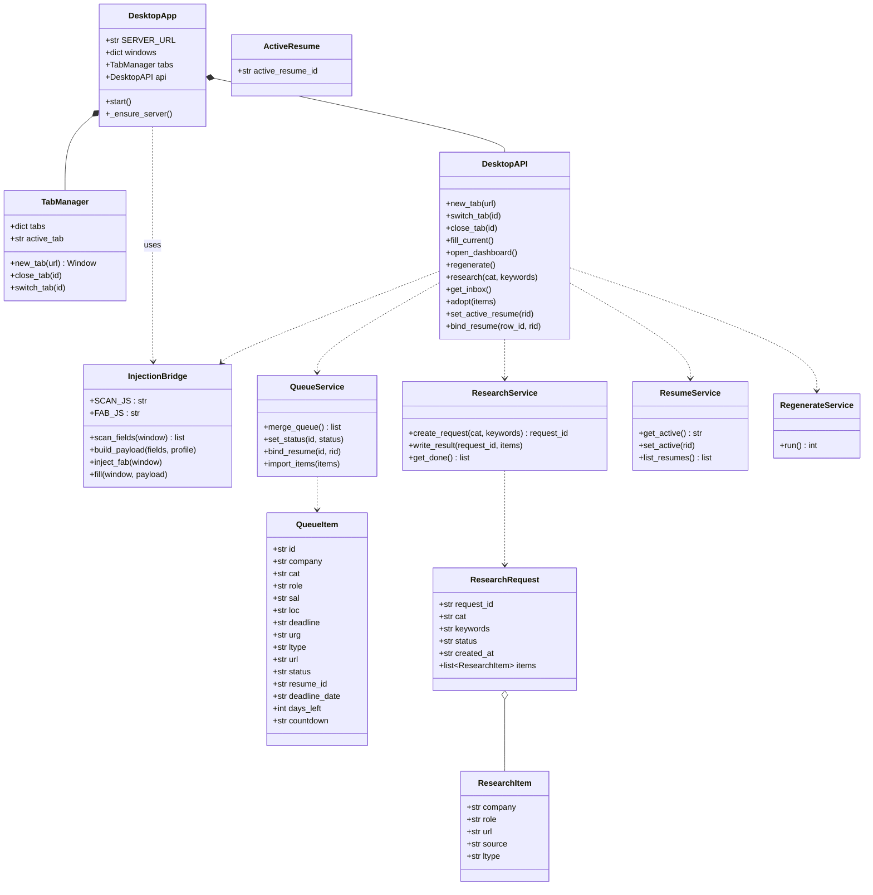
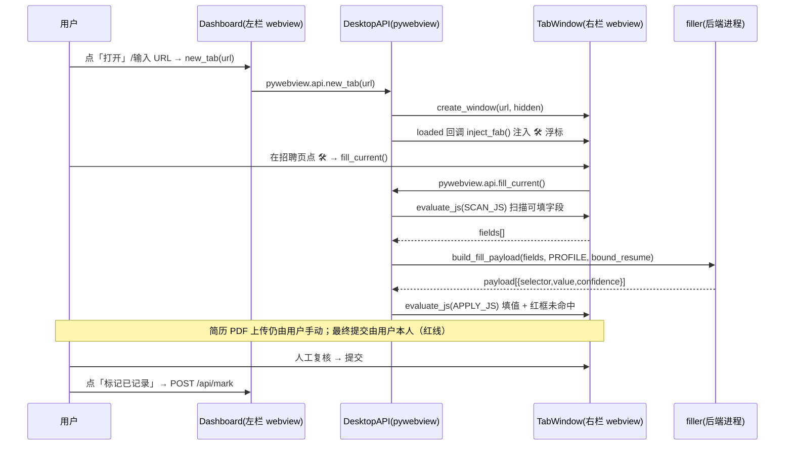
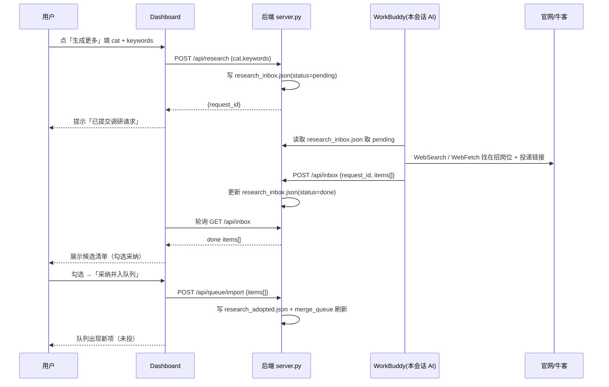
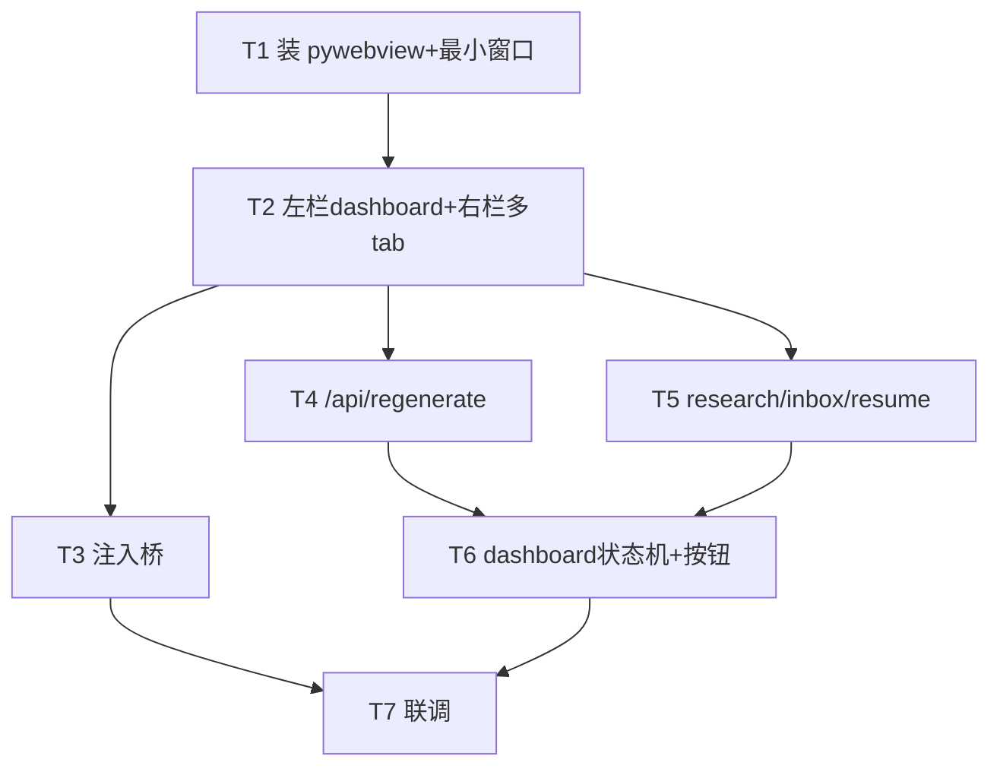

# 网申助手 · 桌面应用（Desktop Shell）系统设计与任务分解

> 作者：架构师 高见远（Bob） ｜ 增量设计，不重写现有代码，仅在 `apply-copilot/` 上叠加桌面壳与少数后端端点。
> 语言：中文（与需求一致）。所有 PII 仅留本地；后端仅绑定 `127.0.0.1`。

---

## 1. 实现方案 + 框架选型确认

### 1.1 核心技术判断（采纳团队结论）

- **招聘官网（阿里/蚂蚁/腾讯/字节等）与 BOSS 直聘均带 `X-Frame-Options: DENY` / `CSP: frame-ancestors 'none'`**，纯网页 `<iframe>` 无法嵌入。因此**必须用语真实浏览器内核**。
- **选定 `Python + pywebview`**：
  - 纯 Python 包，可直接复用现有 FastAPI 后端（`server.py`，`127.0.0.1:8787`，CORS `*`）与网页仪表板；
  - 底层在 Windows 上用系统自带的 **WebView2**（Edge 渲染内核），**无需下载 Electron/Chromium（数百 MB，本机代理仅 ~70KB/s 极慢），也无需装 Rust（Tauri）**；
  - 每个标签页 = 一个真实 WebView2 窗口实例，可用 `evaluate_js()` 向已加载页面注入 JS（等价于扩展 content script），实现「填表」而不碰登录/验证码/提交。
- 备选（仅当用户坚持时切换）：Electron / Tauri。本设计不采用。

### 1.2 窗口布局

单进程、多窗口方案（pywebview 一个本地窗口对应一个 WebView2 实例，无法在「一个窗口内」放多个真实远程 webview，故用**多窗口 + 显隐切换**模拟「真·多标签」）：

```
┌───────────────────────┬───────────────────────────────────────┐
│ 左栏：控制窗 (WebView2) │ 右栏：标签窗 (WebView2) × N，同屏仅显激活项 │
│  load http://127.0.0.1:8787/ │ 每个 tab = 一个 window，hidden 创建    │
│  - 投递队列仪表板        │  switch_tab() 时 hide 其余、show 激活项    │
│  - 多简历选择 + 行绑定    │  位置固定在屏幕右 60% 区域                  │
│  - 记录页状态机 + 倒计时   │  加载完成后注入 🛠 浮标（FAB）             │
│  - 按钮：重生成/生成更多   │                                          │
│  - 标签条（开/关/切换）    │                                          │
└───────────────────────┴───────────────────────────────────────┘
```

- **左控制窗**：加载现有 `dashboard.html`（同源 `http://127.0.0.1:8787/`，可放 `<iframe>` 因为同源、不受 X-Frame-Options 限制）。仪表板内的标签条按钮通过 `window.pywebview.api.*` 调用 Python。
- **右标签窗**：每开一个岗位 URL = `webview.create_window(url, hidden=True)`，存入 `TabManager.tabs[id]`；`switch_tab()` 时 `hide()` 其余、`show()` 激活项并置前。所有标签窗常驻内存（真·同时打开多页），仅视觉上切换。
- **注入桥（InjectionBridge）**：标签窗 `loaded` 回调里 `evaluate_js(FAB_JS)` 注入浮标；用户点浮标 → `window.pywebview.api.fill_current()` → Python 在激活标签窗上 `evaluate_js(SCAN_JS)` 取字段 → 复用 `filler.build_fill_payload(fields, PROFILE)`（**字段规则单一来源 = `filler.FIELD_RULES`**）→ `evaluate_js(APPLY_JS)` 填值 + 红框未命中项。**简历 PDF 上传与最终提交永远由用户本人完成（红线）。**

### 1.3 启动方式

`app_desktop.py` 作为一键启动器：
1. `GET /api/health` 探活；若后端未起，以子进程拉起 `python server.py --port 8787`（沿用现有生产后端，非内联 uvicorn，便于状态文件一致）。
2. 后端就绪后，`webview.start(DesktopAPI, ...)`：先建左控制窗（dashboard），再按需建标签窗。
3. pywebview 主循环必须在主线程（Windows WebView2 要求）。

---

## 2. 文件清单（相对 `apply-copilot/`）

### 新增
| 文件 | 作用 |
|---|---|
| `app_desktop.py` | pywebview 启动器 + `TabManager`（多标签）+ `DesktopAPI`（JS↔Python 桥）+ `InjectionBridge`（扫描/填充/注入 FAB）。一键拉起后端并创建窗口。 |
| `static/assistant_desktop.js` | 注入到远程招聘页的 🛠 浮标脚本（镜像现有 `assistant.bookmarklet.js` 的 UI，但点击改为调用 `window.pywebview.api.fill_current()`）。 |
| `desktop_config.json` | 桌面壳配置：窗口几何（左栏宽比、右栏位置）、默认首页、是否自动拉起后端等。 |
| `research_inbox.json` | 「生成更多」调研请求与结果存储（App 写 pending，WorkBuddy 回写 done+items）。 |
| `resume_active.json` | 记忆「当前简历」（`{active_resume_id}`）。 |
| `research_adopted.json` | 用户从「生成更多」结果中**采纳并入队列**的项（`{items:[...]}`），`merge_queue()` 一并合并。 |

### 修改
| 文件 | 修改点 |
|---|---|
| `server.py` | 新增端点：`POST /api/regenerate`、`POST /api/research`、`GET /api/inbox`、`POST /api/inbox`、`GET/PUT /api/resume/active`、`POST /api/queue/import`、`PUT /api/queue/{id}/bind`；扩展 `PUT /api/queue/{id}/status` 接受 `已投/笔试/面试`；扩展 `merge_queue()` 合并 `research_adopted.json` 与 `bind` 映射；`queue.json` 结构升级为 `{status:{}, bind:{}}`。 |
| `static/dashboard.html` | 新增：多简历下拉 + 每行「绑定简历」；记录页状态机（5 态徽章 + 截止日倒计时红标）；按钮「按投递情况重生成」「生成更多」「采纳并入队列」；标签条 UI；轮询 `/api/inbox` 展示候选并勾选采纳；调用 `pywebview.api`。 |

### 复用（不修改）
- `filler.py`（`FIELD_RULES`、`build_fill_payload`、`parse_html_fields`）——注入桥直接调用，字段规则单一来源。
- `copilot.py`（`load_json/dump_json/load_resumes/score_resume`）、`apply.py`（`cmd_mark` 写 `applications.json`）、`gen_submit_list.py`（父目录，「重生成」子进程调用）。
- `static/assistant.bookmarklet.js`——FAB UI 参考源（不删，仍可独立用）。

---

## 3. 数据结构与 API 契约

### 3.1 数据文件（均存于 `apply-copilot/`）

| 文件 | 结构 | 说明 |
|---|---|---|
| `queue.json`（升级） | `{"status": {id: "进行中"\|"已投"\|"笔试"\|"面试"}, "bind": {id: "algo-v1"}}` | 用户态状态与简历绑定，重生成不被覆盖。 |
| `research_inbox.json` | `{"requests":[{request_id,cat,keywords,status:"pending"\|"done",created_at,done_at,items:[ResearchItem]}]}` | 「生成更多」请求/结果。 |
| `resume_active.json` | `{"active_resume_id":"algo-v1"}` | 当前简历记忆。 |
| `research_adopted.json` | `{"items":[QueueItem...]}` | 采纳并入队列的项，按 company 去重。 |
| `desktop_config.json` | `{"left_ratio":0.4,"autostart_server":true,"home":"/"}` | 桌面壳配置。 |

`ResearchItem` = `{company, role, url, source, ltype:"官网"\|"BOSS"}`
`QueueItem`（merged 后由 `/api/queue` 返回，在原 9 字段基础上扩展）= `{id,company,cat,role,sal,loc,deadline,urg,ltype,url, status, resume_id, deadline_date, days_left, countdown}`

### 3.2 API 契约表

> 现有端点全部保留；下表聚焦**新增/扩展**部分，并标注与现状的差异。

| 方法 & 路径 | 请求体 | 响应 | 说明 / 差异 |
|---|---|---|---|
| `POST /api/regenerate` | `{}` | `{ok, count, generated_at}` | **新增**。子进程运行父目录 `gen_submit_list.py`（读「秋招投递进度.html」反排除、重跑），刷新 `queue_seed.json`；返回项数。以 `cwd=父目录` 执行，保证相对路径正确。 |
| `POST /api/research` | `{cat, keywords}` | `{request_id, status:"pending"}` | **新增**。写 `research_inbox.json`（status=pending），返回 request_id。供「生成更多」触发 WorkBuddy 调研。 |
| `GET /api/inbox` | — | `{done:[{request_id,cat,keywords,items:[ResearchItem]}], pending_count}` | **新增**。返回已 done 的调研结果（App 轮询展示）。 |
| `POST /api/inbox` | `{request_id, items:[ResearchItem]}` | `{ok, request_id}` | **新增（WorkBuddy 回写）**。将请求置 done 并写入 items（等价于直接改写 `research_inbox.json`）。 |
| `GET /api/resume/active` | — | `{active_resume_id}` | **新增**。读 `resume_active.json`。 |
| `PUT /api/resume/active` | `{resume_id}` | `{ok, active_resume_id}` | **新增**。写 `resume_active.json`。 |
| `POST /api/queue/import` | `{items:[QueueItem]}` | `{ok, count}` | **新增**。把「生成更多」中用户勾选采纳的项写入 `research_adopted.json`（按 company 去重），下次 `/api/queue` 即合并进队列。 |
| `PUT /api/queue/{id}/bind` | `{resume_id}` | `{ok, id, resume_id}` | **新增**。行级「用哪份简历投」绑定，存 `queue.json.bind`。 |
| `PUT /api/queue/{id}/status` | `{status}` | `{id, status}` | **扩展**。原仅 `未投/进行中`；现接受 `未投/进行中/已投/笔试/面试`，持久化到 `queue.json.status`。合并优先级：已记录(applications.json) > queue.json 状态 > 未投。 |
| `GET /api/queue` | — | `{items:[QueueItem]}` | **扩展**。在 `merge_queue()` 中额外合并 `research_adopted.json`，并回填每项的 `resume_id`、`deadline_date`、`days_left`、`countdown`。 |
| `GET /api/resumes` | — | `{resumes:[...]}` | 保留。供多简历下拉。 |
| `POST /api/mark` | `{company,title,resume_version?,channel,jd?,date?,note?}` | `{ok,...}` | 保留。最终「标记已记录」写入 `applications.json`（红线闭环：人审后调用）。 |
| `POST /api/fill` / `POST /api/match` / `GET /api/resume-file/{id}` / `GET /api/health` / `GET /` / `/static/*` | — | — | 全部保留。 |

### 3.3 类图（Mermaid）

见同目录 `class-diagram.mermaid`（亦内嵌下方）：



---

## 4. 程序调用流程

### 4.1 开标签 → 注入助手 → 填表 → 人审提交



### 4.2 「生成更多」AI 闭环



### 4.3 关键说明

- **填表值来源**：统一来自 `profile.job.json`（候选人级常量，如姓名/手机/学校），与「绑定哪份简历」无关；绑定简历仅决定 **PDF 附件**与 `/api/mark` 的 `resume_version` 记录。这样多简历版本切换不会影响基础字段填充，符合现状数据模型（resumes.json 只存 path+tags，不存字段值）。
- **红线保障**：注入桥只做「扫描字段 → 填文本 → 红框标未命中 → 用户人工复核 → 用户本人提交」。绝不做：代登录、破解验证码、自动提交、`evaluate_js` 模拟点击提交按钮。
- **倒计时**：`queue_seed.json` 的 `deadline` 为自由文本（如「网申9/26截止!」「正式批约10/30」「招满即止」）。`merge_queue()` 做 best-effort 解析出 `deadline_date` 与 `days_left`：能解析 `MM/DD` 的按当年计算，`days_left<=7` 标红（`countdown:"red"`），`<=14` 标橙；无法解析的退化为按 `urg` 字段标色。详见待明确事项(3)。

---

## 5. 有序任务列表（按实现顺序，含依赖与优先级）

> 说明：以下 T1–T7 为本次需求的预期分解。T4/T5 为纯后端、互不依赖，可在 T2 之后并行；T6 依赖 T4/T5 的契约；T7 为联调。每个任务均含 ≥3 个相关文件；首个任务为桌面壳基础设施。

| ID | 任务名 | 源文件（创建/修改） | 依赖 | 优先级 |
|---|---|---|---|---|
| **T1** | 装 pywebview + 起最小窗口（桌面壳基础设施） | `app_desktop.py`(骨架)、`desktop_config.json`、`docs/deps`(依赖说明) | — | P0 |
| **T2** | 左栏加载 dashboard + 右栏多标签框架 | `app_desktop.py`(TabManager+DesktopAPI+主窗)、`static/dashboard.html`(标签条骨架)、`desktop_config.json` | T1 | P0 |
| **T3** | 注入桥（evaluate_js 复用 filler 逻辑） | `app_desktop.py`(InjectionBridge+inject_fab+fill_current)、`static/assistant_desktop.js`、`filler.py`(复用) | T2 | P0 |
| **T4** | 后端 `/api/regenerate` | `server.py`(+regenerate + RegenerateService)、`gen_submit_list.py`(父目录, 子进程调用) | T2 | P1 |
| **T5** | 后端 research/inbox/resume_active + bind/import | `server.py`(6 端点 + ResearchService/ResumeService)、`research_inbox.json`、`resume_active.json`、`research_adopted.json` | T2 | P1 |
| **T6** | dashboard 多简历 + 记录页状态机 + 按钮 | `static/dashboard.html`(大改)、`server.py`(扩展 status/bind/merge_queue)、`queue.json`(结构升级)、`research_adopted.json` | T4,T5 | P1 |
| **T7** | 联调（一键启动、填表闭环、AI 闭环、红线校验） | 全部文件；`app_desktop.py` 运行脚本 + 手测清单 | T3,T6 | P2 |

依赖关系图（Mermaid）：



---

## 6. 依赖包

```
- pywebview        # 桌面壳：WebView2 封装，每个标签=一个真实 webview，支持 evaluate_js 注入
- fastapi          # 现有后端，已安装
- uvicorn          # ASGI 服务，已安装
- pydantic         # 请求模型，已安装
```

**环境相关（不执行安装，仅列出）：**
- 新的唯一 pip 依赖是 `pywebview`（纯 Python 包，体积小）。
- Windows 需 **WebView2 Runtime**：系统通常已自带（Win10/11 + Edge）。若缺，安装系统组件「Microsoft Edge WebView2 Runtime」（非 Chromium 下载，体积小）。
- 安装走代理：`http://127.0.0.1:7892`，registry `https://pypi.org/simple`；venv python：`C:\Users\you\.workbuddy\binaries\python\envs\default\Scripts\python.exe`。
- **本设计不执行任何 pip install**，仅供 Engineer 参考。

---

## 7. 共享约定

- **后端仅 `127.0.0.1`**：`server.py` 维持 `--host 127.0.0.1`，绝不 `--host 0.0.0.0`。CORS `*` 仅因本机扩展/桌面壳跨源访问，风险可控。
- **人审闭环（红线）**：助手只「填表」，绝不代登录、绝不破解验证码、绝不自动提交。所有「提交」「记录」动作由用户本人触发（`/api/mark` 仅记录，不代替投递）。
- **字段规则单一来源**：前端/注入桥一律复用 `filler.FIELD_RULES` + `filler.build_fill_payload(fields, PROFILE)`，不在 JS 里硬编码规则副本（现有 `assistant.bookmarklet.js` 的静态 RULES 仅作书签兜底，桌面壳改用 Python 驱动以保证与 profile 同步）。
- **配置文件放 `apply-copilot/` 下**：`queue.json` / `research_inbox.json` / `resume_active.json` / `research_adopted.json` / `desktop_config.json` 均在本目录，与现有 `queue_seed.json` 同级。
- **状态持久化分离**：`queue_seed.json` 由 `gen_submit_list.py` 生成（重生成会覆盖）；用户态 `status`/`bind` 存 `queue.json`；「已记录」由 `applications.json` 派生，互不覆盖。
- **日期格式**：内部存储用 ISO 8601；`deadline` 解析失败保留原文本并在 UI 标色。
- **WorkBuddy 回写**：通过 `POST /api/inbox` 或直写 `research_inbox.json` 均可；App 侧以 `GET /api/inbox` 轮询 done 结果。

---

## 8. 待明确事项（需用户/主理人确认）

1. **WebView2 Runtime 是否已安装？** 决定 `pywebview` 能否直接运行。若 `pywebview` 启动报「WebView2 runtime not found」，需先装系统「Microsoft Edge WebView2 Runtime」。建议确认后再排期 T1。
2. **是否确认采用 `pywebview` 而非 Electron/Tauri？** 本设计据此技术锁定；若后续坚持要真正单窗口内嵌多 tab 的「原生标签页 UI」，需改用 PyQt6 + QWebEngineView（需下载 PyQt 轮子，与「不下载大包」初衷冲突），请明确取舍。
3. **截止日倒计时口径**：`queue_seed.json` 的 `deadline` 为自由文本（如「网申9/26截止!」「正式批约10/30」「招满即止」）。是否接受「仅对可解析 `MM/DD` 的项做精确天数倒计时与红标（≤7天红、≤14天橙），其余按 `urg` 字段标色」这一 best-effort 折中？或要求统一改为结构化 `deadline_date` 字段（需改 `gen_submit_list.py` 导出）。

---

## 附：关键文件落点速查

| 诉求 | 落点 |
|---|---|
| 多简历选择 + 行绑定 | `dashboard.html` 下拉 + `PUT /api/queue/{id}/bind` + `queue.json.bind` |
| 记录页状态机 + 倒计时红标 | `dashboard.html` 5 态徽章 + `PUT /api/queue/{id}/status` 扩展 + `merge_queue` 倒计时 |
| 按投递情况重生成 | `POST /api/regenerate` → 子进程 `gen_submit_list.py` |
| 生成更多（AI 闭环） | `POST /api/research` → WorkBuddy → `POST /api/inbox` → `GET /api/inbox` → `POST /api/queue/import` |
| 真·多标签浏览器 | `app_desktop.py` TabManager（多 WebView2 窗 + 显隐切换） |
| 注入式自动填空 | `app_desktop.py` InjectionBridge + `static/assistant_desktop.js`（复用 `filler.FIELD_RULES`） |
| 红线 | 仅填表、不登录/不破解/不提交；人审后 `/api/mark` |
